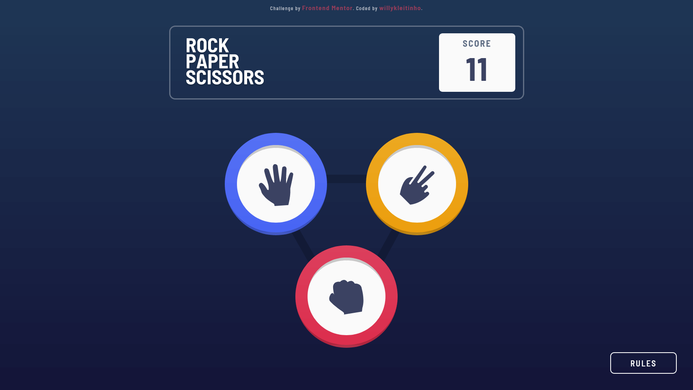

# Frontend Mentor - Rock, Paper, Scissors solution

This is a solution to the [Rock, Paper, Scissors challenge on Frontend Mentor](https://www.frontendmentor.io/challenges/rock-paper-scissors-game-pTgwgvgH). Frontend Mentor challenges help you improve your coding skills by building realistic projects. 

## Table of contents

- [Overview](#overview)
  - [The challenge](#the-challenge)
  - [Screenshot](#screenshot)
  - [Links](#links)
- [My process](#my-process)
  - [Built with](#built-with)
  - [What I learned](#what-i-learned)
- [Author](#author)

## Overview

### The challenge

Users should be able to:

- View the optimal layout for the game depending on their device's screen size
- Play Rock, Paper, Scissors against the computer
- Maintain the state of the score after refreshing the browser _(optional)_
- **Bonus**: Play Rock, Paper, Scissors, Lizard, Spock against the computer _(optional) (Didn't do)_ 

### Screenshot

### Links

- Solution URL: [on Frontend Mentor](.)
- Live Site URL: [on Github Pages](https://willykleitinho.github.io/rock-paper-scissors/)

## My process

### Built with

- CSS custom properties
- Flexbox
- Mobile-first workflow

### What I learned

In this project, I learned more about implementing animations and transitions with CSS, and how to better match the given design.

## Author

- Frontend Mentor - [@willykleitinho](https://www.frontendmentor.io/profile/willykleitinho)
- Github - [@willykleitinho](https://github.com/willykleitinho)
